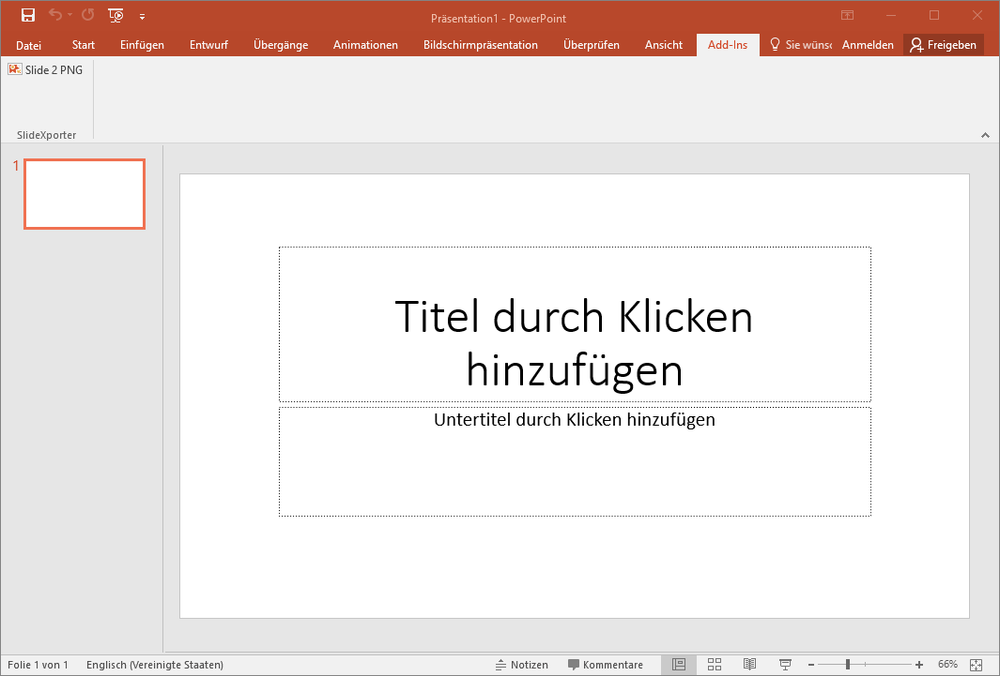
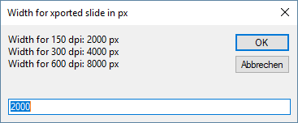
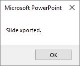
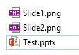
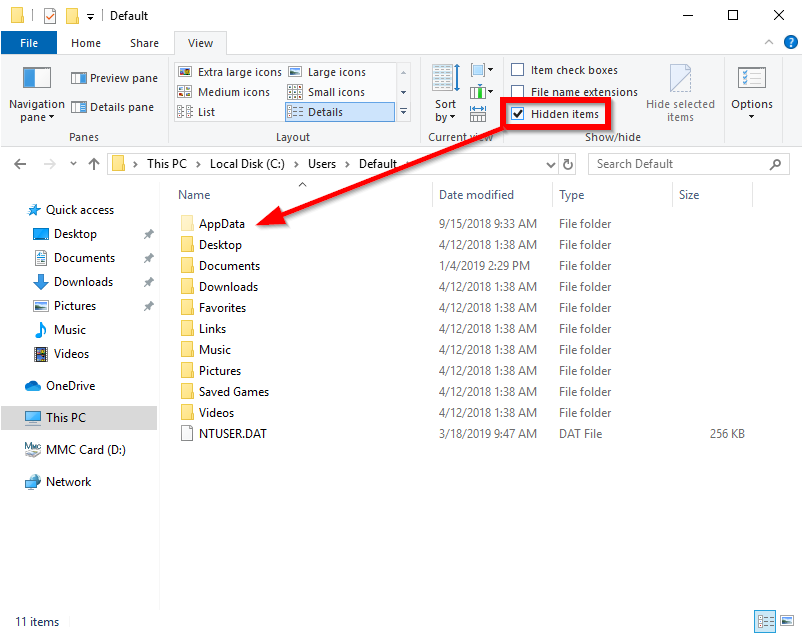
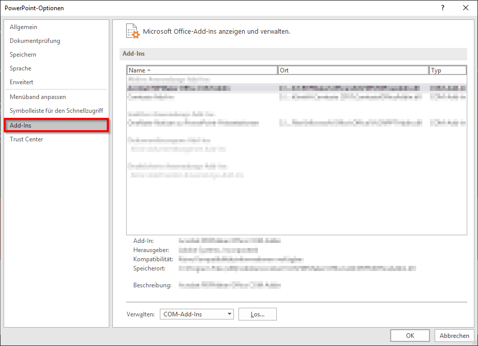
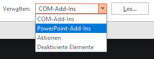
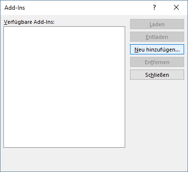
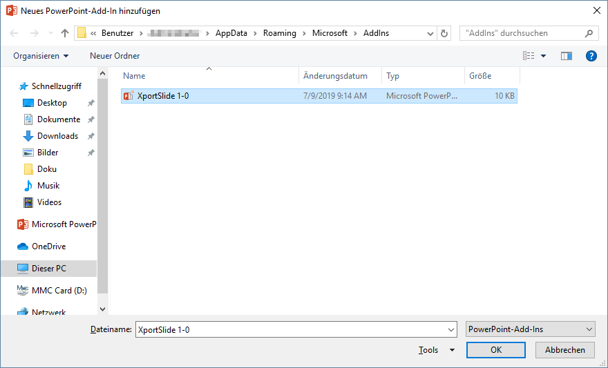
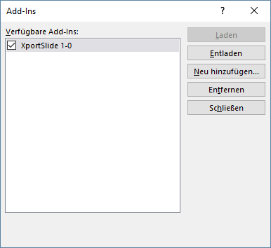

# XportSlide
A PowerPoint Add-In to export the current slide in high resolution (150, 300 &amp; 600 dpi) PNG-images

Sometimes you want to share the stuff you produced in PowerPoint with others. Be it for a book our journal article, hand on a figure to a collegue etc. Taking a screenshot or using PowerPoints iternal export functionality often does not give you the control over the quality of the exported slide you want.

Since I ran quite often into such situations, I wrote a primitve Add-In to export the current slide to an PNG-image with 150, 300, 600 dpi or any other resolution you like. I chose PNG-format to avoid JPG-like artefacts on exported images. 

## How to use it

After installing the Add-In the "Slide 2 PNG" button appears under the "Add-In" ribbon:

Clicking this button activates an input box for defining the width of the exported slide. You can enter any resolution you like, corresponding resolution for 150 (default), 300 and 600 dpi are shown ontop the inputbox. Hitting "OK" starts the export process. 

After successfully writing this export file a confirmation dialog is shown:

The exported image of the current slide is stored in the same folder as the presentation. To identifiy multiple exported slides each slide is given its slide number as name. In this example I exported slides 1 and 2 from the presentation "Test.pptx":

## How to install it

First of all, download the Add-In (.ppam file) and store it somewhere on your harddrive. Technically, an Add-In can be executed from nearly every place on your computer. To have an oversight on your Add-Ins I suggest to store the it in the Microsoft Office's "AddIns" folder, which you can find in your homefolder:

C:\Users\YOUR USERNAME\AppData\Roaming\Microsoft\AddIns

In case you can not see the "AppData" folder, you have to activate "View - Hidden items" in your explorer:

After storing the Add-In (.ppam) file in the "AddIns" folder you can close your explorer, fire up PowerPoint and choose "File - Options - Add-Ins":

